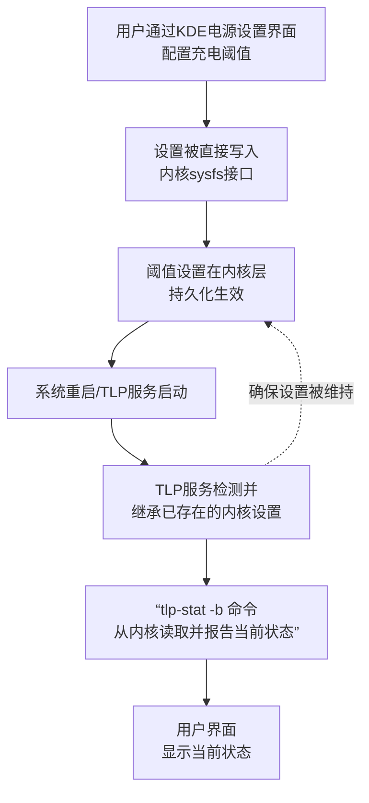

好的，这份重新书写的笔记将基于我们之前的讨论，并整合了您提供的系统截图中的关键信息，以阐明 **KDE GUI 设置**与 **TLP 服务**之间清晰、协同的工作关系。

------

### 📒 TLP 电池管理配置笔记（基于 KDE 图形界面）

#### 1. 核心原理：GUI 与 TLP 的协同工作



所以，**TLP 是系统的电源管理者，而 KDE 设置界面是修改 TLP 所管理参数的一个友好前端**。您通过 GUI 设置的充电阈值，已经通过内核被 TLP 识别并维护，因此重启后依然有效。

#### 2. 安装与验证

- **安装 TLP** (如未安装)： 

  ```bash 
  sudo apt update 
  sudo apt install tlp tlp-rdw 
  sudo systemctl enable tlp.service
  ```

- **验证安装与状态**： 在终端中输入 `sudo tlp-stat -s`，应看到 TLP 服务为 **已启用 (enabled)** 和 **已激活 (active)** 状态。

#### 3. 推荐的配置方法：使用 KDE 系统设置 (GUI)

这是**首选方法**，因为它直观、不易出错，并且直接有效。

1. 打开`系统设置`。
2. 进入`电源管理`（或类似名称，不同 KDE Plasma 版本可能略有差异）。
3. 找到`电池保养`或`充电阈值`相关选项（正如您截图中的界面）。
4. 直接在其中设置： **开始充电阈值**（例如：50%） **停止充电阈值**（例如：90%）
5. 设置后通常立即生效，无需重启。您可以通过截图中的提示信息或终端命令 `sudo tlp-stat -b`来确认。

**优势**：

- **直观**：无需记忆配置参数和文件路径。
- **安全**：避免了手动编辑配置文件可能产生的语法错误。
- **高效**：设置直接作用于系统底层，并被 TLP 服务认可和维护。

#### 4. 备选配置方法：编辑 TLP 配置文件

如果您的桌面环境没有提供图形设置选项，可以直接配置 TLP。

1. **编辑配置文件**： `sudo nano /etc/tlp.conf`

2. **查找并修改参数**。找到以下两行，取消注释（删除行首的 `#`）并修改数值： 

   ```ini
   START_CHARGE_THRESH_BAT0=50 
   STOP_CHARGE_THRESH_BAT0=90
   ```

3. **重启 TLP 服务**以使更改生效： `sudo systemctl restart tlp`

#### 5. 如何验证充电阈值已生效

- **图形界面验证**：在 KDE 电源设置界面中，通常会直接显示提示信息（如您的截图：`Battery is configured to charge up to approximately 90%`）。
- **命令行验证**：在终端中执行： `sudo tlp-stat -b` 在输出信息中检查 `charge_control_start_threshold` 和 `charge_control_end_threshold` 的值，确认是否为设定值。

4. 一些临时使用命令：

以下是对 `tlp`命令中与电池充电相关的子命令的说明，特别是针对您使用的 ThinkPad 笔记本。

| 命令                  | 用途                                                         | 使用场景与示例                                               |
| --------------------- | ------------------------------------------------------------ | ------------------------------------------------------------ |
| **`tlp setcharge`**   | **临时修改充电阈值**（最常用）。**此设置将在下次重启后恢复为GUI中的配置。** | 场景：未来几天会一直插电使用，想更好地保护电池。 示例：`sudo tlp setcharge BAT0 50 80` （设置电池在低于50%时开始充电，到80%时停止） |
| **`tlp fullcharge`**  | **临时将停止充电阈值设为100%，充满一次。** 充满后阈值会恢复。 | 场景：需要长时间外出，希望电池充满。 示例：`sudo tlp fullcharge` （系统会开始充电至100%，下次启动后自动恢复90%的限制） |
| **`tlp chargeonce`**  | **使电池充电至停止阈值一次**。此为一次性指令，适合在 `setcharge`修改后使用。 | 场景：您刚用 `setcharge`调高了停止阈值，现在想让它充到新阈值。 示例：`sudo tlp chargeonce BAT0` （命令电池立即开始充电，直到达到当前设置的停止阈值，如图片中的90%） |
| **`tlp recalibrate`** | **执行电池电量计校准**（慎用）。它会将电池充满再完全放空，以校准电量统计。 | 场景：感觉电量百分比显示不准（如很快从20%掉到5%）。**建议每半年或一年一次，且在校准期间不要使用电脑。**  示例：`sudo tlp recalibrate` |
| **`tlp discharge`**   | **强制完全放电**（特殊用途）。主要用于配合 `recalibrate`或诊断。 | 场景：需要将电池电量快速放空。**日常使用中请避免使用此命令。** |

#### 💎 总结与最佳实践

- **首选 GUI**：您当前的模式（通过 KDE 系统设置配置）是正确且推荐的方式。
- **机制明确**：GUI 修改的是内核参数，TLP 会检测并继承这些参数，从而保证设置持久有效。这就是您未在 `tlp.conf` 中看到配置，但设置却生效的原因。
- **避免混用**：建议固定使用一种配置方法（GUI 或 配置文件），以避免可能产生的混淆。

这份笔记说明了您当前配置的有效性和正确性。您可以放心地继续使用 GUI 方式来管理您的电池健康。
