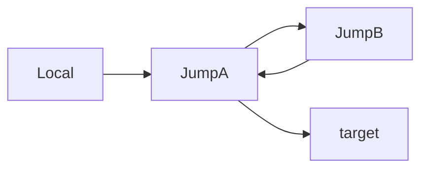

## 1. 基础用法：单跳板机

如果你想通过跳板机 A 访问内网机器 B：

* **命令行：**
```bash
ssh -J userA@JumpHostIP userB@TargetIP

```


* **配置文件 (`~/.ssh/config`)：**
```ssh
Host target
    HostName TargetIP
    User userB
    ProxyJump userA@JumpHostIP

```

* **指定自定义配置文件 (-F)：**

如果你不想使用默认的 ~/.ssh/config，可以使用 -F 参数指定路径：

```bash 
ssh -F /path/to/custom_config target 

```

这里 `target` 直接为文件中指定的目标项的名字。

注意： 使用 -F 会导致 SSH 忽略默认的 ~/.ssh/config。


## 2. 多跳板机连接：

* **命令行：**

如果你需要经过多个跳板机，只需按顺序用逗号分隔：

```bash 
ssh -J userA@JumpHostA,userB@JumpHostB userC@TargetIP
```

原理：SSH 会先连接 A，再从 A 连接 B，最后从 B 连接到目标 C。

* **配置文件 (`~/.ssh/config`)：**
```ssh
Host JumpA 
    HostName JumpHostA
    User userA 

Host JumpB 
    HostName JumpHostB
    User userB 
    ProxyJump JumpA

Host target
    HostName TargetIP
    User userB
    ProxyJump JumpB

```

注意这里有了配置文件后，需要注意以下几种使用方法：

如果想直接连接配置文件中的某个主机，则可以直接写其对应的名称，比如：

```bash 
# 连接跳板机 JumpA，此时为对 A 直连
# 程序会自动读取这个 “Hostname” 对应哪个 IP 以及哪些登录信息
ssh JumpA # 或者 ssh -F ~/.ssh/config JumpA 

# 连接跳板机 JumpB，此时为通过 A 跳板连接 
ssh JumpB 

# 连接最终目标 
ssh target 
```

如果你要连接的目标主机不在配置文件中，那么跳板不会自动生效，而是需要你在命令中使用 `-J` 参数指定使用：

```bash 
ssh -J JumpB user@ip 
# 这里是通过跳板 A 和跳板 B 对最终目标进行连接
# 和下面这种写法等效
ssh -J JumpA,JumpB user@ip 
```

但注意 `-J JumpA,JumpB` 和 `-J JumpB,JumpA` 是不等效的，后者的流量会按照如下流程经过：



你也可以添加配置文件以外的跳板机直接到命令中：

```bash 
ssh -J JumpB,userC@JumpHostC user@ip 
```

---

## 3. 进阶：跳板机端口不在 22

如果跳板机的 SSH 端口改成了非标准端口（例如 `2222`），语法如下：

* **命令行：**
使用 `IP:Port` 的格式。
```bash
ssh -J userA@JumpHostIP:2222 userB@TargetIP

```


* **配置文件：**
配置文件中无需在 `ProxyJump` 里写端口，而是利用 SSH 会**自动查找 Host 定义**的特性：
```ssh
# 先定义跳板机的配置
Host myjump
    HostName JumpHostIP
    Port 2222
    User userA

# 再定义目标机
Host target
    HostName TargetIP
    User userB
    ProxyJump myjump

```


---

## 4. 核心痛点：旧设备只支持 RSA 算法

现代 SSH 客户端（如 OpenSSH 8.8+）默认禁用了不安全的 `ssh-rsa`（SHA-1 签名算法）。如果你的**目标机**或**跳板机**是旧设备，连接会报错（如 `no matching host key type found`）。

### 情况 A：目标机是旧设备

你需要告诉客户端在连接目标时允许 `ssh-rsa`。

* **命令行：**
```bash
ssh -J userA@JumpHostIP -o HostKeyAlgorithms=+ssh-rsa -o PubkeyAcceptedAlgorithms=+ssh-rsa userB@TargetIP

```


* **配置文件：**
```ssh
Host legacy-target
    HostName TargetIP
    User userB
    ProxyJump userA@JumpHostIP
    HostKeyAlgorithms +ssh-rsa
    PubkeyAcceptedAlgorithms +ssh-rsa

```


### 情况 B：跳板机是旧设备

如果跳板机本身版本很低，你需要针对跳板机节点进行配置。

* **配置文件（推荐做法）：**
```ssh
Host old-jump
    HostName JumpHostIP
    User userA
    # 针对跳板机开启旧算法支持
    HostKeyAlgorithms +ssh-rsa
    PubkeyAcceptedAlgorithms +ssh-rsa

Host target
    HostName TargetIP
    User userB
    ProxyJump old-jump

```


---

## 5. 终极方案：多级跳板 + 混合配置

假设你要经过：**跳板 A (2222端口)** -> **跳板 B (旧设备)** -> **目标机器 C**。

**最佳实践是使用 `~/.ssh/config`，逻辑最清晰：**

```ssh
# 1. 第一级跳板：改了端口
Host jump-a
    HostName 1.1.1.1
    Port 2222
    User admin

# 2. 第二级跳板：老旧设备
Host jump-b
    HostName 2.2.2.2
    User root
    ProxyJump jump-a
    HostKeyAlgorithms +ssh-rsa
    PubkeyAcceptedAlgorithms +ssh-rsa

# 3. 最终目标机
Host internal-server
    HostName 192.168.1.100
    User dev
    ProxyJump jump-b

```

**使用时只需输入：**

```bash
ssh internal-server

```

---

### 💡 小贴士

1. **权限检查**：确保你的私钥权限是 `600` (`chmod 600 ~/.ssh/id_rsa`)。
2. **密钥转发**：如果你在跳板机上还需要认证，可以加上 `-A` 参数（ForwardAgent），但为了安全，建议尽量在本地使用 `ssh-copy-id` 将公钥布署到所有节点，实现全链路免密。
3. **调试**：如果连接失败，加上 `-v` 参数查看是在哪一级跳板卡住了。

